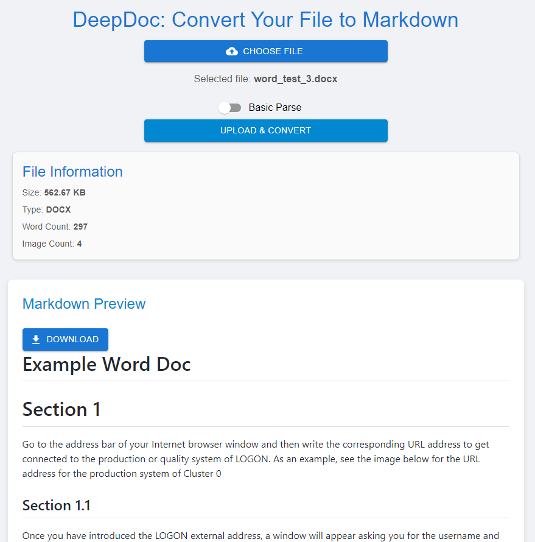

# DeepDoc
An AI-based Doc Parsing and Standardization Platform. 

## Overview

DeepDoc is a full-stack application designed to streamline the process of document format standardization. It takes in different document formats (PDF, DOCX, CSV, and HTML) and converts them into clean Markdown text. The Markdown output is optimized for use cases such as providing context for large language models (LLMs) and storing content in a vector database for retrieval-augmented generation (RAG) workflows. The focus of this application is on effective text extraction, and converting graphical elements into descriptive text for better context enrichment.

## App Screenshot



## Features

### Core Functionality
1. **Document Parsing**
   - Handles various document formats: PDF, DOCX, CSV, and HTML.
   - Extracts titles, headings, text blocks, and converts graphical elements (such as images) into descriptive text.
   - Produces well-structured, clean Markdown optimized for LLM and vector database use cases.

2. **User Interface**
   - Provides a straightforward user interface for uploading files and receiving Markdown output.

3. **Performance and Robustness**
   - Fast processing even for larger files.
   - Gracefully handles errors (e.g., unsupported file types or extraction issues).

4. **Security**
   - Securely handles document data by deleting files after processing.
   - Ensures API keys are stored securely.

### Optional Features
- **LLM Integration**
  - Uses LLMs to enhance extraction quality by correcting malformed or incomplete content.
  - Handles multilingual or inconsistent document sections.

- **Image Recognition**
  - Utilizes Azure OpenAI for generating textual descriptions for visual content, adding more context to the Markdown.

## Technologies Used
- **Frontend**: React
- **Backend**: Python (FastAPI)
- **Libraries**: `pdfminer`, `python-docx`, `pandas`, `BeautifulSoup`, `Azure OpenAI`

## Setup Instructions

1. **Clone the Repository**
   ```bash
   git clone git@github.com:L1uZhentao/DeepDoc.git
   cd DeepDoc
   ```

2. **Set Up Environment Variables**
   - Set the following environment variables in a `.env` file:
     ```
     VISION_ENDPOINT=<Your Azure Vision API endpoint>
     VISION_KEY=<Your Azure Vision API key>
     OPENAPI_KEY=<Your OpenAI Key>
     SENDER_EMAIL=<Your email sender address to send email>
     SMTP_USERNAME=<Your SMTP user name>
     SMTP_PASSWORD=<Your SMTP password>
     ```

     For the Azure Vision API key setup, please refer to the [Azure Vision API Documentation](https://learn.microsoft.com/en-us/azure/ai-services/computer-vision/quickstarts-sdk/image-analysis-client-library-40?tabs=visual-studio%2Clinux&pivots=programming-language-python).

     For the OpenAI API key setup, please refer to the [OpenAI API Documentation](https://platform.openai.com/docs/overview).

3. **Option 1: One docker command to run everything**
   - Just one command to run everything`:
   ```bash
   docker-compose up --build
   ```

   The application will be accessible at `http://127.0.0.1:3000`.

4. **Option 2: Run the backend and frontend seperately**
   - Install the required dependencies using `pip`:
   ```bash
   cd backend
   pip install -r requirements.txt
   ```
   - Start the backend server:
   ```bash
   uvicorn main:app --reload
   ```
   The application will be accessible at `http://127.0.0.1:8000`.
      - Install the required dependencies using `pip`:
   - Open another terminal and run:
   ```bash
   cd frontend
   npm install
   npm start
   ```

## Usage Instructions

1. **Upload a File**
   - Use the UI to upload a document (PDF, DOCX, CSV, or HTML).

2. **Receive Markdown Output**
   - The system will parse the document and provide a Markdown representation optimized for LLM use.

3. **Flexibility to switch between basic/ advanced parsing**
   - For basic parsing, it is quick to extract the text information, but does not consider image information
   - For advanced parsing, it uses Azure AI for image information extraction, and use GPT-4 for markdown enhancement

## Testing

- Unit tests are included to validate the document parsing and enhancement features.
- Install the required dependencies using `pip`:
   ```bash
   pip install -r requirements.txt
   ```
- To run tests:
  ```bash
  pytest tests/
  ```

## Security Considerations

- **Data Security and Privacy**: No user data is stored to ensure privacy and data security.
- **API Key Management**: Store your Azure API keys in environment variables or a secure secret management solution.

## License

This project is licensed under the MIT License.

## Contact

For any inquiries, please reach out to [liuzhentao0613@gmail.com].

